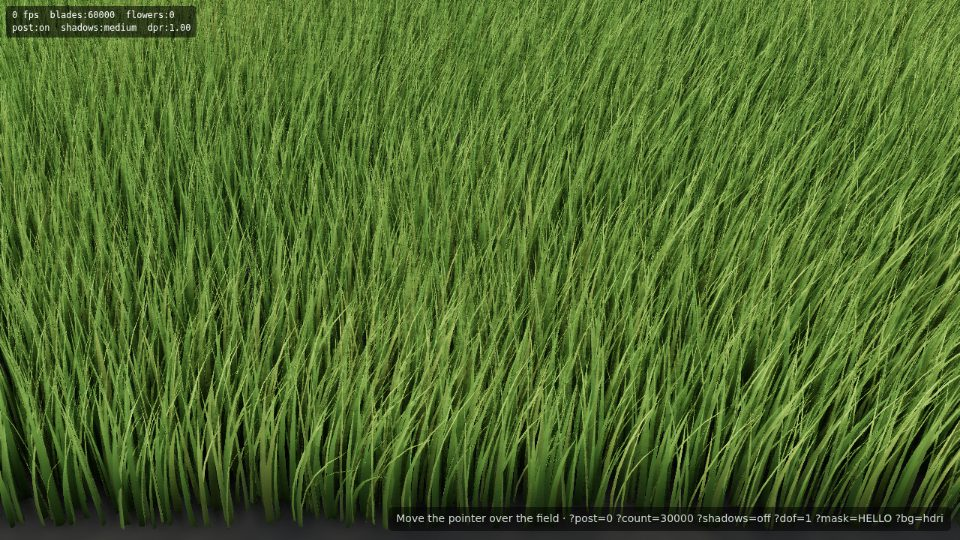
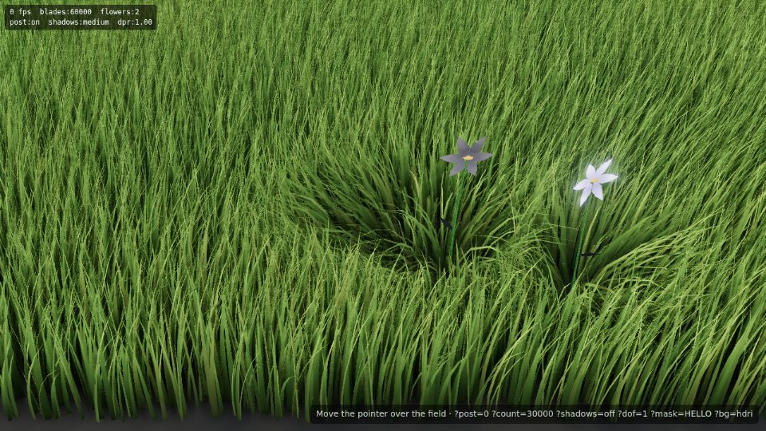
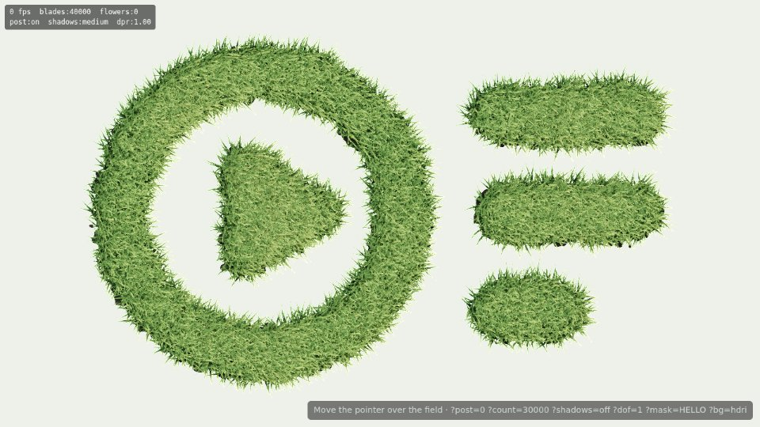
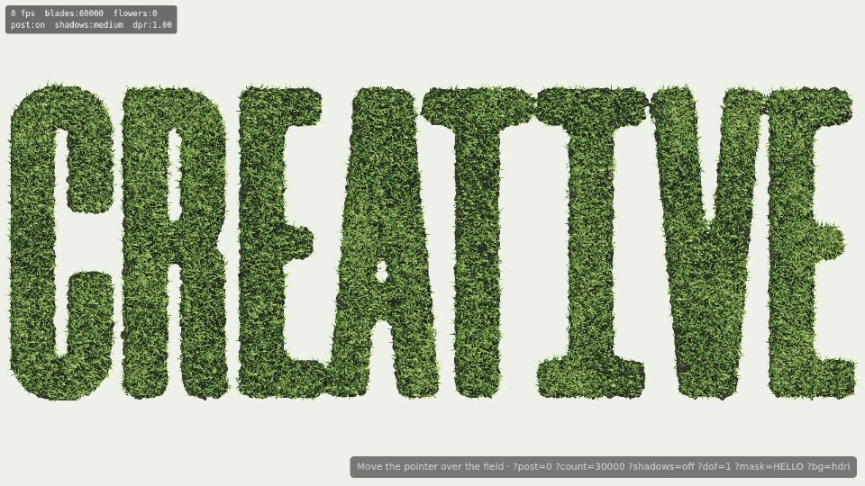

# grass-field

Photoreal-leaning, interactive WebGL grass for the web. Tens of thousands of blades in one
draw call, bending in a procedural wind field, parting around the cursor, and sprouting
flowers that bloom where you hover and wilt when you leave. Built with Three.js and Vite,
shipped as one ES-module bundle that mounts into any DOM container (Webflow Embed included)
with no runtime dependencies.




## Quick start

```bash
npm install
npm run dev        # http://localhost:5173 — demo: ?count= ?post=0 ?shadows=off ?dof=1 ?shape=1 (sample SVG) ?shape=text:HELLO ?tilt=8
npm run build      # regenerates the HDRI, then writes dist/grass-field.js + dist/hdri/meadow-sky.hdr
npm run screenshot # headless smoke test (software WebGL), writes ./screenshots
```

Requirements: Node 20+, a WebGL2-capable browser (Three.js r186 is WebGL2-only).

## What is in the box

| Path | What it does |
| --- | --- |
| `src/index.js` | Public API: `mount(container, options)` and `dispose(target)`. Nothing on `window`. |
| `src/GrassField.js` | Scene, renderer, lighting, event wiring, frame loop, dispose. |
| `src/config.js` | `defaultConfig` (every tunable), deep merge, low-power detection. |
| `src/geometry/bladeGeometry.js` | One tapered, creased, curved blade (5 segments, 16 verts, 26 tris). |
| `src/geometry/flowerGeometry.js` | Low-poly flower authored in its open pose (stem, 6 petals, centre, leaf). |
| `src/scatter.js` | Noise-driven rejection-sampling scatter, per-instance data. |
| `src/shape.js` | SVG/image/text rasterisation into a feathered placement mask + ground texture. |
| `src/flowers.js` | Flower slot pool (spawn, bloom, hold, wilt, reuse). |
| `src/postfx.js` | EffectComposer chain: GTAO, bloom, optional DoF, tone-mapped output. |
| `src/shaders/*.glsl` | All GLSL, injected into Three's PBR materials via `onBeforeCompile`. |
| `scripts/gen-hdri.mjs` | Writes the procedural equirectangular `.hdr` (Radiance RGBE, RLE). |
| `scripts/screenshot.mjs` | Playwright smoke test used to verify each rendering layer. |
| `demo/embed.html` | The Webflow snippet, wired to the local production bundle. |
| `dist/` | Production build output (committed so it can be uploaded to a CDN as-is). |

## How it works

**Blades.** One blade mesh, rendered with `InstancedMesh` (single draw call). Instances are
scattered by rejection sampling against a fractal-noise density so the field has clumps and
thinner patches rather than a grid. Per-instance yaw, lean (`bladeLean`), and uniform scale (height)
are baked into the instance matrix; phase, stiffness, colour seed and height fraction go into
an `aBladeData` instanced attribute. Scatter is seeded, so a given `seed` always produces the
same field.

**Wind, cursor, flowers (vertex shader).** `field_pars.vert.glsl` samples scrolling simplex
noise (gust fronts plus ripples) at each blade's world root, adds a radial push away from
`uCursorPos` (quadratic falloff inside `uCursorRadius`, blended with the pointer's ground
velocity for a wake), and a push away from every live flower in `uFlowers[16]`, scaled by its
bloom. The total is weighted by `uv.y²` so roots stay pinned and tips swing, converted into
the blade's local frame (`transpose(mat3(instanceMatrix)) / scale²`), and the vertex is
lowered by `sqrt(y² − d²)` so the blade keeps its length instead of stretching. Blades under
the cursor or a flower are additionally pressed down. The same bend runs in the shadow-depth
and AO-normal materials so shadows and occlusion follow the bent blades.

**Flowers.** A second `InstancedMesh` with a 16-slot pool. Hovering for `dwellMs` spawns a
flower at the cursor's ground position; JS advances bloom → hold → wilt timers and writes one
`aFlowerState` vec4 per slot (bloom, wilt, seed, colour) plus the shared `uFlowers` uniform the
grass reads. The vertex shader grows the stem, unfolds the petals from a closed bud, curls
them, then droops and desaturates on wilt. A flower stays open while the cursor is within
`holdRadius`; slots are reused, never reallocated.

**Materials and lighting.** Blades use `MeshPhysicalMaterial` (sheen for the velvety
grass look) with injected chunks for a root→tip colour gradient, per-instance hue/straw drift,
fake root occlusion, and a translucency term that brightens blades when the sun is behind them
relative to the viewer. Lighting comes from an equirectangular HDRI through `PMREMGenerator`
(`scene.environment`) plus one shadow-casting `DirectionalLight` aligned with the HDRI's sun
(`sun.azimuth/elevation` must match `scripts/gen-hdri.mjs`). Shadows use a 2048² PCF map by
default. The ground is a mottled `MeshStandardMaterial` plane that receives the shadows.

**Post-processing.** `RenderPass → GTAOPass → UnrealBloomPass → (BokehPass) → SMAAPass →
OutputPass` on a half-float target. GTAO's normal pre-pass is patched to use the
bending-aware normal materials and its shader is hardened against NaN. Everything under
`post` can be switched off individually. The composer target is deliberately not
multisampled: three.js invalidates an MSAA buffer after each resolve, so bloom's additive
blend onto it reads undefined memory on real GPUs and the canvas goes blank. Edge
anti-aliasing comes from SMAA (or `antialias: 'fxaa'` / `'none'`) instead.

## Configuration

`mount(el, options)` deep-merges `options` over `defaultConfig` (see `src/config.js` for every
key and its comment). The ones you will actually touch:

```js
mount('#grass-field', {
  instanceCount: 60000,         // blades. 20k = sparse meadow, 60k = lawn, 100k+ = high-end only
  fieldSize: [13, 8],           // metres [x, z]; the camera is framed for this size
  bladeHeight: [0.28, 0.75],
  clustering: 0.55,             // 0 uniform … 1 heavily clumped
  dprCap: 1.5,                  // biggest single perf lever after instanceCount
  shadows: 'medium',            // 'off' | 'low' | 'medium' | 'high'
  background: null,             // null = transparent canvas (page shows through); '#hex'; or 'hdri'
  post: { enabled: true, ao: true, bloom: true, dof: false, antialias: 'smaa' },
  wind: { direction: [1, 0.35], speed: 0.55, strength: 0.22, scale: 0.32 },
  cursor: { radius: 1.15, strength: 0.55, smoothing: 0.18 },
  flowers: { max: 16, spawnInterval: 260, dwellMs: 90, bloomMs: 900, holdMs: 1400, wiltMs: 1300,
             radius: 0.9, strength: 0.5, petalColors: ['#ffd4e5', '#fff5c2', '#e8d9ff', '#ffe9d1'] },
  colors: { root: '#1c3b12', tip: '#9dc95a', dry: '#c9b86a', variance: 0.6, sss: '#d8f28a' },
  camera: { fov: 31, position: [0, 2.5, 6.3], target: [0, 0.19, 2.68] },
  assets: { hdri: 'https://cdn.example.com/grass/hdri/meadow-sky.hdr' },
  autoDetect: true,             // apply `lowPower` on phones / low-core / reduced-motion devices
  lowPower: { instanceCount: 16000, dprCap: 1, shadows: 'low', post: { enabled: false } },
  debug: false,                 // FPS / count overlay
});
```

Runtime tweaks that don't need a remount: `field.setOptions({ wind: {...}, cursor: {...},
colors: {...}, flowers: {...}, toneMappingExposure, post })`. Structural keys (`instanceCount`,
`fieldSize`, `mask`, `shadows`, `camera`) need `dispose()` + `mount()`.

Events on the container: `grassfield:ready` (HDRI loaded) and `grassfield:error`
(`detail.message`, e.g. no WebGL). On error nothing is drawn, so give the container a
background image as a static fallback.

### Shape-constrained field (SVG / image / text), shot top-down

Set `shapeSource` and the field is placed only inside a silhouette, sized to the shape's
bounding box, and shot from an orthographic camera straight above (the `topDown` preset in
`config.js` is applied underneath your options whenever `shapeSource` is present):

```js
mount('#grass-field', {
  shapeSource: { svg: 'https://cdn.example.com/grass/shapes/logo.svg' },   // or inline '<svg …>' markup
  // shapeSource: { image: 'https://cdn.example.com/logo.png', useLuminance: true }, // black-on-white raster
  // shapeSource: { text: 'HELLO', font: '900 sans-serif' },
  instanceCount: 40000,
  background: null,
});
```



How it works (`src/shape.js`):

- The SVG is fetched (or taken inline), given explicit pixel dimensions from its `viewBox`,
  and rasterised to an offscreen canvas with the long edge at `resolution` (1024 px). Any SVG
  structure the browser can draw works: multiple elements, compound paths with holes, groups,
  transforms, text converted to paths. Live `<text>` depends on the viewer's fonts, and
  external references (linked images, CSS) are not loaded, so convert text to outlines first.
- Alpha (or luminance with `useLuminance: true`) becomes the coverage mask. It is trimmed to the
  content's bounding box plus `margin` (6% of the long edge), and the ground plane and camera
  frustum are sized to that box, so `fieldSize` is derived, not configured. `size` (12) sets
  the long edge in world units, which is what controls blade size relative to the shape.
- Placement is rejection sampling: random (x, z) in the box, accepted with probability
  `smoothstep(threshold − feather, threshold + feather, blurredMask + noise)`. The mask is
  box-blurred by `feather` (3.5% of the long edge) so the threshold sits on a gradient band
  rather than a hard step, and a 3-octave value noise of amplitude `edgeNoise` (0.35 of the
  mask range, at 2.2 cycles per world unit) jitters the threshold so the boundary is ragged.
  These values put the visible edge within about ±0.3 world units of the vector outline:
  enough to look grown rather than cut, without eating small features. For fine
  lettering lower `feather` to 0.02 and `edgeNoise` to 0.2; for a blobby logo you can push
  both up.
- The same mask, threshold, band and noise are uploaded as a texture to the ground shader so
  the soil is discarded outside the shape with a matching ragged edge (`ground: 'shape'`).
  Use `ground: 'full'` for soil across the whole box or `'none'` for no soil.
- Flowers spawn only where `mask.coverage ≥ 0.5` at the cursor. The rasterised mask is
  shared between the scatter, the ground shader and the flower pool; it is never re-rasterised.

Worked example, the CREATIVE wordmark (`public/shapes/creative.svg`, eight outlined letter
paths, 1648×619, strokes down to 4% of the height):

```js
mount('#grass-field', {
  shapeSource: { svg: 'https://…/shapes/creative.svg', size: 24, feather: 0.01, edgeNoise: 0.25 },
  bladeHeight: [0.22, 0.5],           // shorter grass keeps thin strokes and counters legible
  cursor: { radius: 1.7, strength: 0.7 },
  flowers: { radius: 1.3, strength: 0.7, headScale: 2.4 },
  instanceCount: 60000,
});
```

Why these values: at the default `size` 12 the C's stroke is 0.19 world units, thinner than a
blade is tall, so the letters blur into a ribbon; `size` 24 makes it 0.38 units and the letters
hold. The default `feather` (3.5% of the long edge, 36 px of blur at 1024 px) is wider than the
16 px stroke and pushes it under the threshold, so `feather` drops to 0.01. Shorter blades
(0.22–0.5) keep the counters of the R and A open; the taller default reads fine for the outer
outline but fills them in. Cursor and flower radii scale up with the field so the parting stays
visible at this size. Going to `size` 30 with 0.2–0.42 blades is crisper still but starts to
read as a noise texture rather than grass.



Camera and lighting for the top-down view:

- `camera.type: 'orthographic'`, tilted `camera.tilt` = **8°** off vertical toward +Z. From
  0° a single-plane blade is a hairline, so the preset also bakes a static lean of 12–42° into
  every blade (`bladeLean`) and widens them slightly (`bladeWidth` 0.06). The lean is what makes
  blades read as blades from above; the 8° tilt on top adds a consistent side silhouette along
  the lower edges of the shape. At 0° the shape still reads because of the lean, but it looks
  flatter. The cross-plane blade (`bladeCross: true`, two intersecting planes per blade) is
  implemented as the fallback the brief describes and was not needed at 8°.
- The frustum contains the whole box plus `camera.padding` and then expands along the
  container's longer axis, so nothing is cropped. To avoid letterboxing, give the container the
  shape's aspect ratio: after mount, `field.shapeAspect` holds it, or set
  `aspect-ratio: 640 / 400` in CSS from your SVG's viewBox.
- The sun drops to **24° elevation** (from 28°) so blades throw visible shadows onto their
  neighbours from above. That inter-blade shadowing is what gives the aerial view texture; the
  material alone reads as a flat green fill. The HDRI is unchanged: its sun disc is a few degrees
  higher than the light, which is invisible in practice. Flowers in this preset are taller than
  the grass (`flowers.height` 0.95–1.2) with a 1.7× head so they clear the leaning blade tips,
  and their petals are wound to face +Y so they are lit from above.

Cursor raycasting is unchanged: `Raycaster.setFromCamera` handles orthographic cameras and the
ground plane is still y = 0, so parting and flower spawning work as before within the shape.

## Performance

The default is **60 000 blades**. Reasoning:

- The blade is 26 triangles, so 60k blades ≈ 1.56 M triangles in the main pass, plus one
  shadow pass and one AO normal pass (both cheaper: depth/normal only). That is comfortable for
  a mid-range laptop GPU (Iris Xe / Apple M1 / GTX 1650 class) at 1080p with `dprCap: 1.5`
  and stays at the display refresh rate; the frame is vertex- and fill-bound roughly equally.
- Visually, the field saturates around 50–60k for the default 13×8 m area and this camera:
  beyond that the ground stops showing through and extra blades only cost.
- All per-blade work is on the GPU. The CPU does a raycast, 16 flower timers and a uniform
  upload per frame, so the JS side is negligible at any count.

What to turn first when you need headroom (biggest win first):

1. `dprCap` 1.5 → 1 (fill rate, especially with post enabled).
1. `post.antialias: 'fxaa'` (cheaper than SMAA) or `'none'`.
2. `post.ao: false` (GTAO is the most expensive pass), then `post.enabled: false`.
3. `instanceCount` 60k → 30k. Density falls noticeably below ~25k for this area.
4. `shadows: 'low'` or `'off'`.

To scale up on strong hardware: `instanceCount: 120000`, `shadows: 'high'`, `post.dof: true`,
`dprCap: 2`. Above ~150k blades consider a smaller `fieldSize` instead; blades hidden behind
others don't add anything.

`autoDetect` applies the `lowPower` block (16k blades, DPR 1, small shadow map, no post) on
mobile user agents, coarse-pointer devices with ≤4 cores or ≤4 GB, `saveData`, or
`prefers-reduced-motion`. The render loop pauses when the tab is hidden or the container
scrolls out of view, and the pointer influence eases out when the cursor leaves.

The headless screenshots in this repo were rendered with SwiftShader (software GL) and only
prove correctness, not frame rate; measure on real hardware with `debug: true`.

## Asset hosting

Webflow will not host the bundle or the HDRI, so upload the contents of `dist/` to any static
host with CORS and long cache headers (Cloudflare R2/Pages, S3 + CloudFront, Netlify, Vercel,
Bunny, a GitHub Pages branch):

```
https://cdn.example.com/grass/grass-field.js        (~760 KB, ~176 KB gzip; Three.js is bundled)
https://cdn.example.com/grass/hdri/meadow-sky.hdr   (~410 KB)
```

Keep the `hdri/` folder next to the bundle: when `assets.hdri` is not set, the loader resolves
`./hdri/meadow-sky.hdr` relative to the bundle URL. Point `assets.hdri` at any other
equirectangular `.hdr` (e.g. a CC0 sky from polyhaven.com; 1k resolution is plenty since only
lighting is derived from it) and update `sun.azimuth`/`sun.elevation` so the shadow light
matches its sun. The bundled sky is generated by `scripts/gen-hdri.mjs` (partly cloudy,
sun at azimuth 215°, elevation 28°) because it needs no licence and no download.

Serve the `.hdr` with `Content-Type: image/vnd.radiance` or `application/octet-stream` and
`Access-Control-Allow-Origin: *` (it is fetched with `fetch`, so CORS applies).

## Webflow embed

1. Add a Section (or Div Block) for the hero. Give it `position: relative`, a height
   (e.g. `80vh`), and optionally a background image as the no-WebGL fallback.
2. Drop an **Embed** element inside that section and paste:

```html
<div id="grass-field" style="position:absolute;inset:0;"></div>
<script type="module">
  import { mount } from 'https://cdn.example.com/grass/grass-field.js';
  mount('#grass-field', {
    // assets: { hdri: 'https://cdn.example.com/grass/hdri/meadow-sky.hdr' }, // only if hosted elsewhere
    instanceCount: 60000,
    background: null,      // transparent: the section's own background shows through
  });
</script>
```

3. Put your heading/content in the same section with `position: relative; z-index: 1` and
   `pointer-events: none` if it should not block the hover (the canvas listens on its
   container, so text over the field still lets flowers bloom underneath when it ignores
   pointer events).

Notes:
- Nothing else is required on the Webflow side; the bundle is self-contained (Three.js
  included) and touches only the element you give it.
- The canvas follows the container's size via `ResizeObserver`, so responsive breakpoints work.
- For page transitions (Webflow interactions, Barba, Swup, etc.) call `dispose()` before
  removing the section and `mount()` again after inserting it. `mount()` on an element that
  already has a field disposes the old one first. `dispose()` frees all GPU resources and
  forces context loss so repeated transitions don't leak.

```js
import { mount, dispose } from 'https://cdn.example.com/grass/grass-field.js';
const field = mount('#grass-field');
// later
dispose(field);        // or field.dispose(), or dispose('#grass-field')
```

## Development notes

- Shaders live in `src/shaders/*.glsl` and are imported with Vite's `?raw`. They are
  injected into Three's `MeshPhysicalMaterial` / `MeshStandardMaterial` / depth / normal
  materials through `onBeforeCompile` so PBR, env-map, shadow and post-processing support
  stays Three's own; the custom parts are the bending, colouring and translucency chunks.
  `#include <common>` is the injection point, so `noise.glsl` → `field_pars` → material pars
  order is guaranteed by `_injectField()`.
- `MAX_FLOWERS` is 16 in both `field_pars.vert.glsl` and `GrassField.js`; change both.
- `npm run screenshot -- "?count=20000" name` renders the dev page headlessly and writes
  `screenshots/name-{idle,hover,bloom,wilt}.png`; `npm run screenshot -- "dist:?debug" name`
  does the same for the production bundle via `demo/embed.html`.
